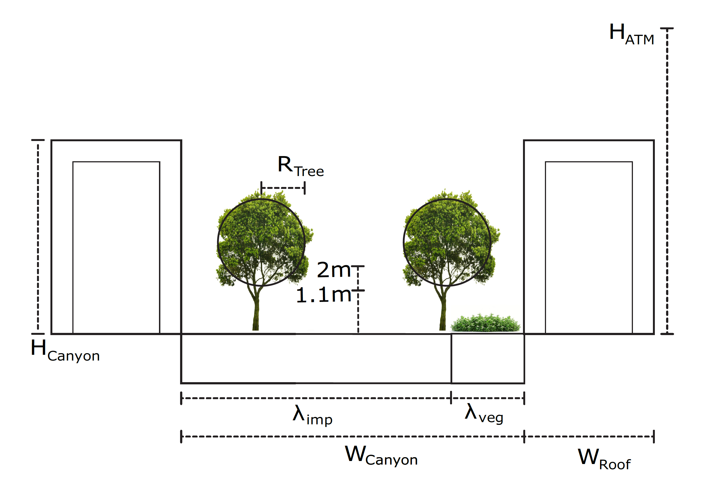

# ReSpaceInteraction
We created an interactive graphic which lets you explore interactions and trade offs of microclimate in an urban setting. 
The heat wave and location of the baseline urban canyon are set in Braunschweig, Germany in August 2021.

Microclimate is assessed via 3 heat stress metrics T_peak, T_night and UTCI_peak. 
T_peak quanitifies the highest temperature in the urban setting during a simulated heat wave.
T_night quanitifies the lowest temperature in the urban setting following the hottest day during the simulated heat wave.
UTCI_peak quanitifies the highest Universal Thermal Comfort Index during the simulated heat wave.

The schematic view of the street canyon as described in the UT&C (meili et al. 2020) is depicted below. 

Parameters that can be altered and their meaning: 

| Symbol | Name | Description |
|--------|------|-------------|
| H_c | Canyon height | Height of the urban canyon walls |
| W_c | Canyon width | Distance between buildings (street width) |
| W_r | Roof width | Width of the building rooftop |
| O_c | Canyon Orientation | Compass orientation of the street canyon |
| α_w | Wall albedo | Reflectivity of building wall surfaces |
| α_r | Roof albedo | Reflectivity of building roof surfaces |
| f_veg,G | Ground vegetation fraction | Share of ground covered by vegetation |
| λ_dry,G | Ground conductivity | Thermal conductivity of the impervious ground material |
| c_v,G | Ground heat capacity | Volumetric heat capacity of the impervious ground |
| λ_w | Wall conductivity | Thermal conductivity of the wall material |
| c_v,s,w | Wall heat capacity | Volumetric heat capacity of the walls |
| R_t | Radius scaling | Tree crown radius |

